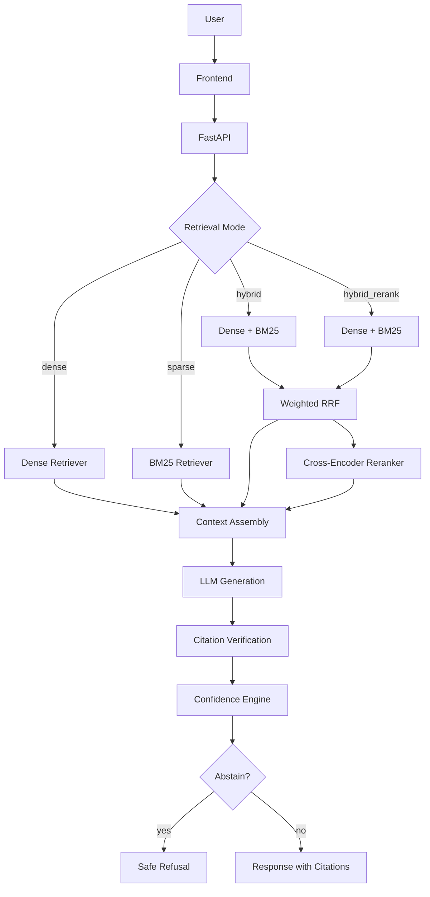

# HybridRAG — Production-Grade Hybrid Retrieval-Augmented Generation System

A Retrieval-Augmented Generation system combining dense semantic retrieval, BM25 lexical retrieval, Reciprocal Rank Fusion, cross-encoder reranking, citation verification, and confidence estimation — built with FastAPI, ChromaDB, FastEmbed (ONNX), and OpenRouter.

---

## Table of Contents

- [Project Overview](#project-overview)
- [Key Features](#key-features)
- [Architecture](#architecture)
- [Retrieval Pipeline](#retrieval-pipeline)
- [Grounding & Safety Pipeline](#grounding--safety-pipeline)
- [Benchmark Results](#benchmark-results)
- [Grounding Results](#grounding-results)
- [Performance](#performance)
- [Resource Requirements](#resource-requirements)
- [Production Hardening](#production-hardening)
- [Keep-Warm Cron](#keep-warm-cron)
- [Frontend](#frontend)
- [API Reference](#api-reference)
- [Installation](#installation)
- [Configuration](#configuration)
- [Deployment](#deployment)
- [Project Structure](#project-structure)
- [Known Limitations](#known-limitations)
- [License](#license)

---

## Project Overview

HybridRAG solves a practical problem: **single-method retrieval leaves gaps**. Dense semantic search misses exact terminology. BM25 lexical search misses conceptual similarity. Neither alone provides reliable grounding for LLM-generated answers.

This system combines both approaches through Weighted Reciprocal Rank Fusion, optionally reranks with a cross-encoder, then verifies citations against retrieved evidence before presenting results. A confidence engine decides when to abstain rather than risk an unsupported answer.

**Why hybrid retrieval works:**

| Weakness | Dense handles it | BM25 handles it |
|----------|------------------|-----------------|
| Conceptual similarity | ✅ | ❌ |
| Exact terminology | ❌ | ✅ |
| Synonym matching | ✅ | ❌ |
| Rare/technical tokens | ❌ | ✅ |

RRF merges both ranked lists into a single ranking that captures strengths of each method.

**Why grounding matters:**

Retrieval finds relevant chunks. Generation produces an answer. But the answer might not be supported by the retrieved chunks. Citation verification checks each claim against evidence, and the confidence engine determines whether the system has enough support to answer or should abstain.

---

## Key Features

### Retrieval

- **Dense semantic retrieval** — vector similarity via FastEmbed ONNX (`BAAI/bge-small-en-v1.5`) with MMR diversity
- **BM25 sparse retrieval** — lexical matching with configurable k1/b parameters
- **Hybrid RRF** — weighted Reciprocal Rank Fusion (dense 0.7 / sparse 0.3)
- **Cross-encoder reranking** — FlashRank TinyBERT-L-2-v2 (~23 ms, ~785 MB peak)
- **Retrieval provenance** — full trace through dense → BM25 → RRF → reranker stages

### Grounding

- **Claim extraction** — sentence-level parsing with inline citation detection
- **Citation verification** — dual gate: cosine similarity ≥ 0.65 + lexical overlap ≥ 20%
- **Citation mapping** — each claim linked to source document, page, chunk ID
- **Confidence scoring** — weighted composite of retrieval + grounding signals
- **Abstention guardrails** — automatic refusal when confidence falls below threshold

### Evaluation

- **Frozen 50-question golden dataset** — 15 single-hop, 10 exact-term, 10 multi-hop, 10 unanswerable, 5 ambiguous
- **Retrieval metrics** — Recall@1/5/10, MRR, NDCG@5, MAP
- **Grounding metrics** — abstention accuracy, false-answer rate, answerable coverage

### Production

- Structured JSON logging with request IDs
- Prometheus metrics at `/metrics`
- Per-IP sliding-window rate limiting (60 req/60s)
- OpenRouter circuit breaker (3 failures → open, 30s recovery)
- Liveness probe (`/healthz`), readiness probe (`/readyz`)
- Docker with non-root user and HEALTHCHECK
- GitHub Actions keep-warm cron (every 5 minutes)

---

## Architecture

```
User
  │
  ▼
Frontend (GitHub Pages)
  │
  ▼
FastAPI Backend (Render)
  │
  ├─ Retrieval Mode
  │   ├─ Dense ──────── FastEmbed ONNX + ChromaDB (MMR)
  │   ├─ Sparse ─────── BM25 index (lexical)
  │   ├─ Hybrid ─────── Dense + BM25 → Weighted RRF
  │   └─ Hybrid Rerank ─ Dense + BM25 → RRF → Cross-Encoder
  │
  ├─ Context Assembly
  │
  ├─ LLM Generation (OpenRouter / gpt-4o-mini)
  │
  ├─ Citation Verification
  │   ├─ Claim Extraction
  │   ├─ Evidence Verification (cosine + lexical dual gate)
  │   └─ Citation Mapping
  │
  ├─ Confidence Engine
  │   ├─ Retrieval Confidence (dense/bm25/rrf/reranker signals)
  │   ├─ Grounding Confidence (verification results)
  │   └─ Abstention Decision
  │
  └─ Response
      ├─ answer
      ├─ citations (verdict, source, page, snippet)
      ├─ confidence (level, score, abstention flag)
      └─ retrieval_trace (per-stage counts)

Observability
  ├─ Structured JSON logs (request_id, timestamp, endpoint, status, duration)
  ├─ Prometheus metrics (requests, latency, retrieval, reranker, LLM, errors)
  ├─ Rate limiter (sliding window, per-IP, health probes exempt)
  └─ Circuit breaker (CLOSED → OPEN → HALF_OPEN)
```

### Mermaid Diagram



---

## Retrieval Pipeline

### Dense Retrieval

Semantic search using FastEmbed ONNX embeddings (`BAAI/bge-small-en-v1.5`, 384-dimensional) stored in ChromaDB. Uses Maximum Marginal Relevance (MMR) to balance relevance with diversity, preventing redundant chunks.

| Parameter | Default |
|-----------|---------|
| `top_k` | 10 |
| `fetch_k` | 20 |
| `mmr_lambda` | 0.5 |
| `min_relevance_score` | 0.35 |

### BM25 Sparse Retrieval

Lexical retrieval using a persistent BM25 index. Handles exact terminology, technical tokens, and rare words that dense embeddings may underweight.

| Parameter | Default |
|-----------|---------|
| `top_k` | 10 |
| `k1` | 1.5 |
| `b` | 0.75 |

### Hybrid RRF Retrieval

Dense and BM25 results are combined using Weighted Reciprocal Rank Fusion:

```
RRF(d) = w_dense / (k + rank_dense(d)) + w_sparse / (k + rank_sparse(d))
```

| Parameter | Default |
|-----------|---------|
| `k` | 60 |
| `w_dense` | 0.7 |
| `w_sparse` | 0.3 |
| `top_k_dense` | 10 |
| `top_k_sparse` | 10 |
| `top_k_fused` | 10 |

Tie-breaking is deterministic: sorted by `(-rrf_score, chunk_id)`.

### Hybrid Rerank

Hybrid RRF candidates are passed through a cross-encoder reranker for precision re-ordering.

| Parameter | Default |
|-----------|---------|
| Model | `ms-marco-TinyBERT-L-2-v2` |
| `candidate_k` | 20 |
| `top_k` | 5 |
| Rerank latency | ~23 ms |
| Peak memory | ~785 MB |

The reranker is disabled by default (`RERANKER_ENABLED=false`) due to memory requirements. Enable it on instances with 2 GB+ RAM.

**Fallback:** If the model fails to load or scoring fails, the RRF pool is returned truncated with `reranker_status="failed"`. The system never crashes on reranker failure.

---

## Grounding & Safety Pipeline

The grounding pipeline verifies that LLM-generated answers are supported by retrieved evidence:

1. **Retrieval** — fetch candidate chunks via the selected mode
2. **Generation** — LLM produces an answer grounded in the context
3. **Claim extraction** — split the answer into individual factual claims
4. **Evidence verification** — for each claim, compute support against retrieved evidence using a dual gate:
   - Cosine similarity ≥ 0.65 (semantic match)
   - Lexical overlap ≥ 20% (token-level match)
5. **Citation mapping** — link verified claims to source documents, pages, and chunk IDs
6. **Confidence calculation** — weighted composite of retrieval signals + grounding results
7. **Abstention** — if confidence < 0.50 or grounding is insufficient, return a safe refusal message

**Abstention message:**

> "I don't have enough evidence in the provided documents to answer this reliably."

This is not a failure — it is a deliberate safety mechanism. The system is designed to reduce unsupported-answer risk rather than attempt to answer every question.

**Confidence thresholds:**

| Level | Threshold |
|-------|-----------|
| High | ≥ 0.75 |
| Medium | ≥ 0.40 |
| Low | < 0.40 |
| Abstain | < 0.50 |

---

## Benchmark Results

All results are measured on the **frozen 50-question golden dataset** (15 single-hop, 10 exact-term, 10 multi-hop, 10 unanswerable, 5 ambiguous).

### Retrieval Quality

| Mode | Recall@1 | Recall@5 | Recall@10 | MRR | NDCG@5 | MAP |
|------|----------|----------|-----------|-----|--------|-----|
| Dense | 0.78 | 1.00 | 1.00 | 0.8833 | 0.7575 | 0.7374 |
| BM25 | 0.76 | 1.00 | 1.00 | 0.8683 | 0.7105 | 0.6960 |
| Hybrid RRF | 0.82 | 1.00 | 1.00 | 0.9033 | 0.7713 | 0.7529 |
| Hybrid + Reranker | **0.90** | **1.00** | **1.00** | **0.9500** | **0.9400** | **0.8967** |

**Key observations:**

- Hybrid RRF improves Recall@1 by +4% over dense alone by combining semantic and lexical signals
- Cross-encoder reranking adds a further +8% Recall@1 over Hybrid RRF
- All modes achieve Recall@5 = 1.00, meaning relevant chunks are always in the top 5
- TinyBERT reranker achieves these results at ~23 ms per query

### Reranker Comparison

| Reranker | Recall@1 | MRR | Latency | Peak Memory |
|----------|----------|-----|---------|-------------|
| None (Hybrid RRF) | 0.82 | 0.9033 | — | ~724 MB |
| TinyBERT-L-2-v2 | 0.90 | 0.9500 | ~23 ms | ~785 MB |
| MiniLM-L-12-v2 | 0.94 | 0.9700 | ~648 ms | ~1143 MB |

TinyBERT is the default: it provides the best quality-per-millisecond tradeoff for production use.

---

## Grounding Results

Evaluated on the 50-question dataset with threshold 0.50 (live LLM active):

| Metric | Value |
|--------|-------|
| Unsupported questions | 15 (10 unanswerable + 5 ambiguous) |
| Answerable questions | 35 |
| Abstention accuracy | 73.3% (11/15 unsupported correctly abstained) |
| False-answer rate | 26.7% (4/15 unsupported questions received answers) |
| False-abstention rate | 25.7% (9/35 answerable questions were refused) |
| Answerable coverage | 74.3% (26/35 answerable questions answered) |

> **Note:** The grounding evaluation methodology was corrected in Phase 7. The original v1.7 tag showed 0% abstention due to a threshold wiring issue. The tag was preserved for historical integrity; corrected values are documented here and in `evals/grounding_correction_report.md`.

The abstention system is conservative by design — it trades answerable coverage for reduced risk of unsupported answers. The false-abstention rate can be tuned by adjusting `CONFIDENCE_THRESHOLD`.

---

## Performance

Measured on the 50-question evaluation dataset (Render standard plan, 1 GB):

### Total Latency (retrieval + generation + verification)

| Mode | Mean | P50 | P95 |
|------|------|-----|-----|
| Dense | 1342.4 ms | 277.7 ms | 9259.8 ms |
| BM25 | 242.6 ms | 243.2 ms | 263.3 ms |
| Hybrid | 292.8 ms | 266.8 ms | 371.9 ms |
| Hybrid Rerank | 295.7 ms | 267.2 ms | 457.1 ms |

### Retrieval-Only Latency

| Mode | Mean | P50 | P95 |
|------|------|-----|-----|
| Dense | 1342.3 ms | 277.6 ms | 9259.6 ms |
| BM25 | 242.5 ms | 243.2 ms | 263.1 ms |
| Hybrid | 292.7 ms | 266.7 ms | 371.7 ms |
| Hybrid Rerank | 295.6 ms | 267.1 ms | 456.9 ms |

### Cold Start Latency

| Mode | Cold Start |
|------|-----------|
| Dense | 396.4 ms |
| BM25 | 1259.0 ms |
| Hybrid | 2332.3 ms |
| Hybrid Rerank | 2812.2 ms |

> **Note:** Dense P50 (277.7 ms) is much lower than the mean (1342.4 ms) due to occasional Chroma garbage collection / lock contention on first-token vector lookups. BM25 and Hybrid show more consistent latency profiles.

Latency depends on embedding model, LLM availability, reranker mode, cold-start state, and hardware. The LLM generation step (OpenRouter) dominates total latency for dense mode when the model is cold.

---

## Resource Requirements

| Tier | Status | Notes |
|------|--------|-------|
| 512 MB | **UNSUPPORTED** | Peak memory with reranker is ~785 MB. Even without reranker, embedding + ChromaDB + BM25 can exceed 512 MB. |
| 1 GB | Minimum practical | Supports dense, sparse, and hybrid modes. Reranker may cause OOM under load. |
| 2 GB | Recommended | Supports all modes including hybrid_rerank with TinyBERT. |

**Why 512 MB fails:**

The FastEmbed ONNX runtime, ChromaDB, BM25 index, and FastAPI together consume ~724 MB baseline. Adding TinyBERT pushes peak to ~785 MB. Render's 512 MB tier cannot accommodate this.

---

## Production Hardening

### Structured Logging

JSON-formatted logs with:
- `request_id` — unique per request (UUID4)
- `timestamp` — ISO 8601
- `endpoint` — request path
- `method` — HTTP method
- `status_code` — HTTP status
- `duration_ms` — request duration

No secrets, API keys, or query content are logged.

### Prometheus Metrics

Available at `/metrics`:

| Metric | Type | Description |
|--------|------|-------------|
| `http_requests_total` | Counter | Total requests by endpoint, method, status |
| `http_request_latency_seconds` | Histogram | Request latency distribution |
| `rag_retrieval_latency_seconds` | Histogram | Retrieval latency by mode |
| `rag_generation_latency_seconds` | Histogram | LLM generation latency |
| `rag_reranker_latency_seconds` | Histogram | Reranker latency |
| `rag_verification_latency_seconds` | Histogram | Citation verification latency |
| `rag_confidence_score` | Histogram | Confidence score distribution |
| `rag_abstentions_total` | Counter | Total abstentions by mode |
| `rag_errors_total` | Counter | Total errors by endpoint and code |

### Rate Limiting

Per-IP sliding-window rate limiter:

| Setting | Default |
|---------|---------|
| Requests | 60 |
| Window | 60 seconds |
| Storage | In-memory (single instance) |

Health probes (`/healthz`, `/readyz`, `/metrics`) are exempt from rate limiting.

Response headers: `X-RateLimit-Limit`, `X-RateLimit-Remaining`, `Retry-After` (on 429).

### Circuit Breaker

Protects OpenRouter LLM calls:

```
CLOSED ──(3 failures)──► OPEN ──(30s timeout)──► HALF_OPEN ──(success)──► CLOSED
```

When OPEN, all LLM requests return a safe fallback message immediately. The circuit breaker never crashes the API.

### Health Endpoints

| Endpoint | Purpose | Rate Limited |
|----------|---------|-------------|
| `GET /health` | Full health (Chroma + BM25 + disk) | Yes |
| `GET /healthz` | Lightweight liveness probe | No |
| `GET /readyz` | Readiness with storage details | No |
| `GET /metrics` | Prometheus text format | No |

---

## Keep-Warm Cron

An external GitHub Actions workflow reduces Render cold-sleep occurrences by pinging the health endpoint on a schedule.

| Setting | Value |
|---------|-------|
| Provider | GitHub Actions |
| Workflow | `.github/workflows/render-keepalive.yml` |
| Schedule | `*/5 * * * *` (every 5 minutes) |
| Endpoint | `GET $RENDER_HEALTH_URL` |
| Timeout | 10 seconds |
| LLM call | None |
| State modification | None |

**Required setup:** Set `RENDER_HEALTH_URL` as a GitHub Actions repository variable with your backend's health URL (e.g., `https://rag-doc-search-1.onrender.com/healthz`).

**What it does:**
- Sends a lightweight GET request to `/healthz`
- Logs HTTP status and latency
- Fails visibly if the endpoint is unavailable

**What it does NOT do:**
- Call `/v1/ask` or invoke the LLM
- Upload documents or modify application state
- Consume OpenRouter credits
- Guarantee zero cold starts

> The external health check reduces the likelihood of cold starts while the workflow is active, but its effectiveness depends on the Render service plan and current platform behavior. Cold starts may still occur.

---

## Frontend

The frontend is a static HTML/JS/CSS application hosted on GitHub Pages. It communicates with the Render backend over HTTPS.

### Features

- **Retrieval mode selector** — Dense, BM25, Hybrid, Hybrid + Rerank
- **Top-k controls** — configurable retrieval depth (1–50) and rerank final count (1–20)
- **Citations** — source document, page number, supported/unsupported verdict, text snippet
- **Confidence panel** — level (high/medium/low), overall score, retrieval confidence, grounding confidence, abstention flag
- **Retrieval trace** — per-stage chunk counts (Dense, BM25, Hybrid RRF, Reranker)
- **Error handling** — 429 rate-limit retry, backend unavailable state, structured error display
- **Auto-refresh** — health status and document list update every 15 seconds

### Configuration

`frontend/config.js` auto-detects the environment:

| Environment | API URL |
|-------------|---------|
| Localhost | `http://localhost:9826` |
| Render (same-origin) | Empty string |
| GitHub Pages / External | `https://rag-doc-search-1.onrender.com` |

No manual URL editing is needed per environment.

---

## API Reference

### Endpoints

| Method | Path | Description |
|--------|------|-------------|
| `GET` | `/health` | Full health check (Chroma + BM25 + disk) |
| `GET` | `/healthz` | Liveness probe |
| `GET` | `/readyz` | Readiness probe with storage details |
| `GET` | `/metrics` | Prometheus metrics |
| `POST` | `/v1/ask` | Full RAG pipeline (retrieval + generation + grounding) |
| `POST` | `/v1/ingest` | Upload and queue a document for ingestion |
| `GET` | `/v1/documents` | List all document statuses |
| `GET` | `/v1/documents/{id}` | Get single document status |
| `DELETE` | `/v1/documents/{id}` | Delete document and its indexed chunks |
| `POST` | `/upload` | Legacy upload endpoint |
| `POST` | `/search` | Legacy search endpoint |

### POST /v1/ask

**Request:**

```json
{
  "question": "What chunk size is configured for the text splitter?",
  "retrieval_mode": "hybrid_rerank",
  "top_k_dense": 10,
  "top_k_sparse": 10,
  "top_k_fused": 20,
  "top_k_final": 5
}
```

| Field | Type | Default | Range |
|-------|------|---------|-------|
| `question` | string | required | 1–2000 chars |
| `retrieval_mode` | string | `"dense"` | `dense`, `sparse`, `hybrid`, `hybrid_rerank` |
| `top_k_dense` | int | 10 | 1–50 |
| `top_k_sparse` | int | 10 | 1–50 |
| `top_k_fused` | int | 20 | 1–50 |
| `top_k_final` | int | 5 | 1–20 |

**Response (success):**

```json
{
  "answer": "The text splitter is configured with a chunk size of 1200 characters.",
  "status": "answered",
  "citations": [
    {
      "claim": "chunk size of 1200 characters",
      "source": "architecture_overview.md",
      "page": null,
      "chunk_id": "a1b2c3d4",
      "verdict": "supported",
      "text_snippet": "The text splitter uses a chunk size of 1200 characters with 200 characters of overlap."
    }
  ],
  "confidence": {
    "overall_score": 0.82,
    "level": "high",
    "retrieval_confidence": 0.78,
    "grounding_confidence": 0.86,
    "abstention_flag": false,
    "signals": {
      "dense": 0.75,
      "bm25": 0.60,
      "rrf": 0.80,
      "reranker": 0.92,
      "grounding": 0.86
    }
  },
  "grounding_metrics": {
    "total_claims": 1,
    "supported_claims": 1,
    "unsupported_claims": 0,
    "grounding_ratio": 1.0,
    "citation_coverage": 1.0,
    "citation_accuracy": 1.0
  },
  "retrieval_trace": {
    "dense": {"count": 10, "chunks": ["..."]},
    "bm25": {"count": 10, "chunks": ["..."]},
    "rrf": {"count": 20, "chunks": ["..."]},
    "reranker": {"count": 5, "chunks": ["..."], "reranker_status": "ok"}
  }
}
```

**Response (abstention):**

```json
{
  "answer": "I don't have enough evidence in the provided documents to answer this reliably.",
  "status": "insufficient_context",
  "citations": [],
  "confidence": {
    "overall_score": 0.25,
    "level": "low",
    "retrieval_confidence": 0.20,
    "grounding_confidence": 0.30,
    "abstention_flag": true
  }
}
```

---

## Installation

### Prerequisites

- Python 3.12+
- Git

### Local Setup

```bash
git clone https://github.com/devashish588/RAG-Doc-Search.git
cd RAG-Doc-Search

python -m venv .venv

# Windows
.venv\Scripts\activate

# macOS/Linux
source .venv/bin/activate

pip install -r requirements.txt
```

### Optional: LLM Configuration

Create a `.env` file (git-ignored):

```text
OPENROUTER_API_KEY=sk-or-v1-...
OPENROUTER_MODEL=openai/gpt-4o-mini
```

Without an API key, the system returns retrieved context without LLM-generated answers.

### Run

```bash
python main.py
```

Open: http://127.0.0.1:9826

API docs: http://127.0.0.1:9826/docs

### Docker

```bash
docker build -t hybridrag .
docker run -p 9826:9826 -e OPENROUTER_API_KEY=sk-or-v1-... hybridrag
```

Or with docker-compose:

```bash
docker compose up
```

---

## Runtime Dependency Verification

### Requirements

- Python 3.12+
- `chromadb` — vector database (declared in `requirements.txt`)
- `fastembed` — ONNX embeddings (declared in `requirements.txt`)
- `numpy` — array operations for BM25 and deduplication (declared in `requirements.txt`)
- `rank-bm25` — BM25 sparse retrieval (declared in `requirements.txt`)

### Validate Installation

```bash
python -c "import chromadb, fastembed, numpy, rank_bm25; print('Runtime dependencies OK')"
```

### Startup Validation

On startup, the application validates:
1. All critical runtime dependencies are importable
2. FastEmbed initializes successfully (production only)
3. ChromaDB vector store is accessible

If validation fails, startup logs contain a clear error identifying the missing package and installation command.

### Health Probes

| Endpoint | Purpose |
|----------|---------|
| `GET /healthz` | Lightweight liveness (no dependency checks) |
| `GET /readyz` | Full readiness including dependency health |

The `/readyz` endpoint returns `503` if any critical dependency is missing.

### Memory Requirements

| Tier | Status |
|------|--------|
| 512 MB | **UNSUPPORTED** |
| 1 GB | Minimum practical |
| 2 GB | Recommended |

---

## Configuration

All settings are configurable via environment variables. See `.env.example` for the full list.

### Core Settings

| Variable | Default | Description |
|----------|---------|-------------|
| `ENVIRONMENT` | `development` | `development` or `production` |
| `LOG_LEVEL` | `INFO` | Python logging level |
| `CORS_ORIGINS` | `*` | Comma-separated allowed origins |
| `OPENROUTER_API_KEY` | — | OpenRouter API key (optional) |
| `OPENROUTER_MODEL` | `openai/gpt-4o-mini` | LLM model |

### Retrieval Settings

| Variable | Default | Description |
|----------|---------|-------------|
| `DENSE_TOP_K` | 10 | Dense retrieval result count |
| `DENSE_FETCH_K` | 20 | ChromaDB MMR fetch count |
| `DENSE_MMR_LAMBDA` | 0.5 | MMR diversity weight |
| `BM25_TOP_K` | 10 | BM25 result count |
| `BM25_K1` | 1.5 | BM25 k1 parameter |
| `BM25_B` | 0.75 | BM25 b parameter |
| `RRF_K` | 60 | RRF constant k |
| `RRF_DENSE_WEIGHT` | 0.7 | RRF dense weight |
| `RRF_SPARSE_WEIGHT` | 0.3 | RRF sparse weight |

### Reranker Settings

| Variable | Default | Description |
|----------|---------|-------------|
| `RERANKER_ENABLED` | `false` | Enable cross-encoder reranking |
| `RERANKER_MODEL` | `ms-marco-TinyBERT-L-2-v2` | Reranker model |
| `RERANKER_CANDIDATE_K` | 20 | Candidate pool size |
| `RERANKER_TOP_K` | 5 | Final output count |

### Confidence Settings

| Variable | Default | Description |
|----------|---------|-------------|
| `CONFIDENCE_THRESHOLD` | 0.50 | Abstention threshold |
| `CONFIDENCE_HIGH_THRESHOLD` | 0.75 | High confidence level |
| `CONFIDENCE_MEDIUM_THRESHOLD` | 0.40 | Medium confidence level |

### Production Settings

| Variable | Default | Description |
|----------|---------|-------------|
| `RATE_LIMIT_REQUESTS` | 60 | Requests per window |
| `RATE_LIMIT_WINDOW_SECONDS` | 60 | Rate limit window |
| `CIRCUIT_BREAKER_FAILURE_THRESHOLD` | 3 | Failures before open |
| `CIRCUIT_BREAKER_RECOVERY_SECONDS` | 30 | Recovery timeout |
| `MAX_UPLOAD_MB` | 25 | Upload size limit |
| `MAX_TOP_K` | 50 | Maximum top_k |
| `MAX_TOP_K_FINAL` | 20 | Maximum top_k_final |
| `REQUEST_TIMEOUT` | 60 | LLM request timeout |

---

## Deployment

### Backend — Render

1. Push to GitHub
2. Render → New → Blueprint → select repo
3. `render.yaml` provisions: web service + 1 GB persistent disk
4. Set `OPENROUTER_API_KEY` in Render dashboard
5. Set `CORS_ORIGINS` to your GitHub Pages origin

| Setting | Value |
|---------|-------|
| Plan | `standard` (1 GB min, 2 GB recommended) |
| Build | `pip install -r requirements.txt` |
| Start | `uvicorn backend.main:app --host 0.0.0.0 --port $PORT` |
| Health | `/healthz` |

### Frontend — GitHub Pages

1. Run `.\deploy-gh-pages.ps1` (PowerShell)
2. GitHub → Settings → Pages → Branch → `gh-pages` / `/root`
3. Open `https://<user>.github.io/RAG-Doc-Search/`

### Keep-Warm

1. GitHub → Settings → Secrets and variables → Actions → Variables
2. Create `RENDER_HEALTH_URL` = `https://rag-doc-search-1.onrender.com/healthz`
3. Workflow runs automatically every 5 minutes

---

## Project Structure

```
.
├── backend/
│   ├── main.py              # FastAPI app, health probes, middleware
│   ├── api_v1.py            # /v1/ask, /v1/ingest, /v1/documents
│   ├── schemas.py           # Pydantic request/response models
│   ├── settings.py          # Environment configuration
│   ├── retrieval_dense.py   # Dense semantic retrieval (ChromaDB + MMR)
│   ├── retrieval_bm25.py    # BM25 sparse retrieval
│   ├── retrieval_hybrid.py  # Hybrid RRF fusion
│   ├── retrieval.py         # Search response assembly
│   ├── reranker.py          # Cross-encoder reranking (FlashRank)
│   ├── verifier.py          # Citation verification
│   ├── confidence.py        # Confidence estimation & abstention
│   ├── llm.py               # OpenRouter LLM generation
│   ├── monitoring.py        # Structured logging, Prometheus metrics
│   ├── middleware.py         # Rate limiter
│   ├── circuit_breaker.py   # OpenRouter circuit breaker
│   ├── storage_health.py    # Chroma/BM25/disk health checks
│   ├── ingestion.py         # Document loading, chunking
│   ├── ingestion_queue.py   # Background ingestion worker
│   ├── vector_store.py      # Embeddings + ChromaDB
│   ├── webapp.py            # Serves frontend for local dev
│   └── reconciliation.py    # Index reconciliation
├── frontend/
│   ├── index.html           # UI markup
│   ├── styles.css           # Styling
│   ├── app.js               # UI logic + API calls
│   └── config.js            # API base URL (auto-detected)
├── evals/
│   ├── golden_dataset.json  # Frozen 50-question evaluation set
│   ├── measure_production_latency.py  # Cold-start measurement
│   ├── phase11_production_smoke_test.py  # Production smoke test
│   └── results/             # Benchmark results
├── tests/
│   ├── conftest.py          # Shared fixtures
│   ├── test_baseline_regression.py
│   ├── test_phase1.py       # API contracts
│   ├── test_phase2.py       # Ingestion pipeline
│   ├── test_phase3_dense.py # Dense retrieval
│   ├── test_phase4_bm25.py  # BM25 retrieval
│   ├── test_phase5_hybrid.py # Hybrid RRF
│   ├── test_phase6_reranker.py # Cross-encoder
│   ├── test_phase7_citation_confidence.py # Grounding
│   ├── test_phase8_evaluation_engine.py   # Metrics
│   ├── test_phase9_production_operations.py # Ops
│   ├── test_phase10_production_validation.py # Validation
│   └── test_phase11_production_ops.py # Keep-warm, security
├── docs/
│   ├── PRODUCTION_OPERATIONS.md
│   ├── PHASE11_DEPLOYMENT_CHECKLIST.md
│   └── PHASE11_CLOSURE_REPORT.md
├── .github/workflows/
│   └── render-keepalive.yml  # External keep-warm cron
├── Dockerfile
├── docker-compose.yml
├── render.yaml
├── requirements.txt
├── requirements-dev.txt
├── .env.example
└── .gitignore
```

---

## Known Limitations

1. **512 MB Render tier is unsupported** — peak memory (~785 MB with reranker) exceeds the free tier
2. **Rate limiter is in-memory** — resets on restart, not shared across instances
3. **Circuit breaker state is not persistent** — resets on restart
4. **Cold starts** — Render suspends idle services; keep-warm reduces but does not eliminate them
5. **Grounding is conservative** — 25.7% false-abstention rate on answerable questions at threshold 0.50
6. **LLM dependency** — without `OPENROUTER_API_KEY`, the system returns context only (no generated answers)
7. **Single-instance deployment** — no horizontal scaling support for rate limiting or circuit breaker state
8. **Dense latency variance** — Chroma GC/lock contention causes occasional spikes (P95 = 9259 ms vs P50 = 277 ms)

---

## Release History

| Tag | Phase | Description |
|-----|-------|-------------|
| `v1.0-baseline` | 0 | Initial baseline |
| `v1.1-foundation` | 1 | Data models, API contracts |
| `v1.2-ingestion` | 2 | Document loading, chunking, deduplication |
| `v1.3-dense` | 3 | Dense semantic retrieval |
| `v1.4-bm25` | 4 | BM25 sparse retrieval |
| `v1.5-hybrid` | 5 | Hybrid RRF fusion |
| `v1.6-reranker` | 6 | Cross-encoder reranking |
| `v1.7-grounding` | 7 | Citation verification & confidence |
| `v1.8-evaluation` | 8 | Evaluation engine & benchmarking |
| `v1.9-production` | 9 | Production hardening & ops |
| `v1.10-production` | 10 | Frontend integration & go-live |
| `v1.11-production-ops` | 11 | Keep-warm cron & deployment docs |

---

## License

MIT
